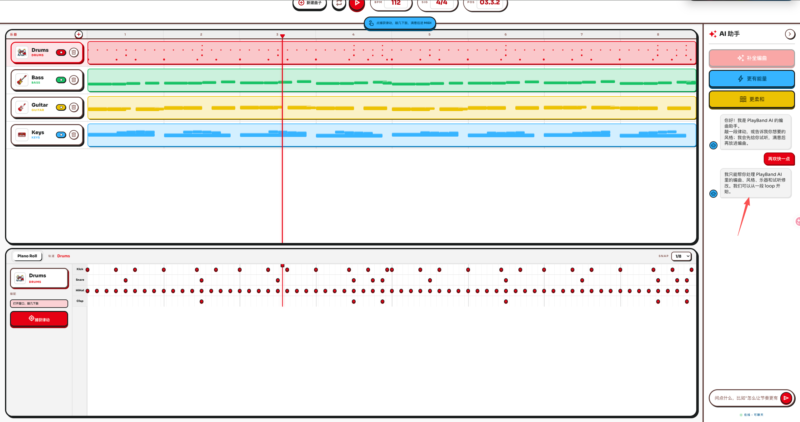

# PlayBand AI

**Play first. Arrange later.**

PlayBand AI is a hackathon prototype for people who have musical taste but do
not know how to use a DAW. Instead of starting from an empty professional
timeline or asking an AI to produce a black-box audio file, the user first
plays a tiny rhythm or melody. The arrangement agent then expands that seed
into an editable 8-bar band loop.

- Public demo: https://wenwen.zone/playband/
- Repository: https://github.com/wtn98498/SoloVerseHackathon-ArrangeAgent



## Why This Exists

GarageBand, Logic, Ableton, and FL Studio are powerful, but they are intimidating
for casual creators. A non-musician can say "make it more energetic" or "give me
a catchy intro", but they usually cannot translate that into drums, bass,
guitar, keyboard parts, MIDI timing, and note density.

PlayBand AI turns that natural language and playful input into structured music:

- The user taps or plays a small idea.
- The app records it as lightweight MIDI-like data.
- The agent completes it into four playable tracks.
- Every AI result appears as a preview first.
- The user can audition, reject, regenerate, or apply the result.

The memorable moment is simple: **a few taps become a band.**

## Demo Flow

The app now opens directly on the blank demo starting point: four empty tracks,
the drum track selected, and the AI assistant waiting for a seed.

The intended 60-90 second demo path is:

1. Open https://wenwen.zone/playband/.
2. Click **捕获律动** on the drum track.
3. Tap a few pads such as **Kick**, **Snare**, and **HiHat**.
4. Click **捕获进 MIDI** to place the seed on the timeline.
5. Click **补全编曲** in the AI assistant.
6. Audition the generated 8-bar loop.
7. Click **放进编曲** only when the preview feels right.
8. Click **更有能量** or type a music request such as `faster again`.

The important detail: the agent does not overwrite the song immediately. It
creates a candidate arrangement so the user keeps creative control.

## What Works

- Four-track arrangement surface: drums, bass, guitar, and keys.
- Piano-roll-style visualization for trust and light editing.
- Pad capture flow with preview, undo, clear, audition, and import.
- Agent preview cards with audition, apply, retry, and discard actions.
- Multi-turn arrangement edits such as faster/slower, softer/more energetic,
  catchier sections, and broader music-style requests.
- Living artist style requests are rewritten into broader musical traits instead
  of directly imitating a living artist.
- Deterministic fallback generation keeps the demo working without an API key.

## Agent Behavior

The arrangement agent is intentionally small and demo-safe. It routes user input
into a few reliable actions:

- **Complete arrangement**: expand a seed pattern into a full 8-bar loop.
- **Increase energy**: raise tempo/velocity and add denser musical motion.
- **Soften arrangement**: lower intensity and create more space.
- **Compose from language**: accept broad music prompts, ask 1-2 clarifying
  questions when the request is too vague, and keep off-topic chat out.

The app treats music-related language generously. Prompts like `make a prelude`,
`add trap groove`, `make the melody rise`, or `make the harmony thicker` should
stay inside the music workflow instead of being rejected as small talk.

## Data Model

PlayBand AI uses a lightweight MIDI-like JSON model instead of a full DAW engine.
The central object is an `ArrangementProject` with:

- `tempo`, `style`, `mood`, `bars`
- four `Track` objects
- `Clip` objects containing `NoteEvent` or `DrumHit` data
- 8 bars, 4 beats per bar, 128 sixteenth-note steps

This keeps the MVP small while still making the generated result visible,
playable, and transformable.

## Tech Stack

- React 18
- TypeScript
- Vite
- Tone.js for browser audio playback
- Custom lightweight arrangement agent
- DeepSeek-ready backend wrapper with local deterministic fallback

## Run Locally

```bash
npm install
npm run dev
```

Then open the local Vite URL, usually:

```text
http://127.0.0.1:3000/
```

If that port is busy, Vite will print the next available local URL.

## Useful Commands

```bash
npm run typecheck
npm run build
VITE_BASE_PATH=/playband/ npm run build
node --experimental-specifier-resolution=node --loader ts-node/esm src/arrangement/agentIntent.test.ts
```

## Optional AI Key

The demo path works without a model key because fallback generation is built in.
To experiment with the DeepSeek path, create a local environment file from
`.env.example` and set:

```text
DEEPSEEK_API_KEY=your_api_key_here
```

Do not commit real API keys.

## Project Structure

```text
src/contracts/      Shared arrangement types and API contracts
src/arrangement/   Agent intent routing, generators, transformers, validation
src/backend/       Local service layer, validation, DeepSeek wrapper, fallback
src/frontend/      React UI, editor state, Tone.js audio engine, components
src/fixtures/      Demo project fixtures
docs/              Product plan, contracts, agent briefs, design notes
```

## Hackathon Scope

This is not trying to be a full DAW. The MVP deliberately avoids:

- full MIDI editing
- plugin hosting
- cloud project sync
- accounts
- collaboration
- complex export workflows
- large sample libraries

The goal is one memorable moment: **play a tiny idea, then watch an agent turn it
into editable music.**
