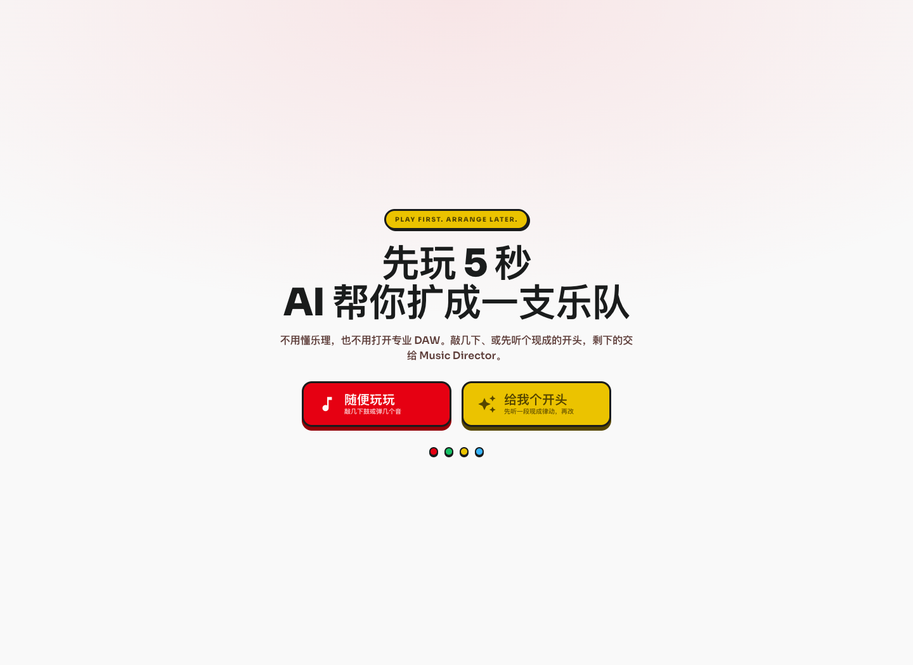
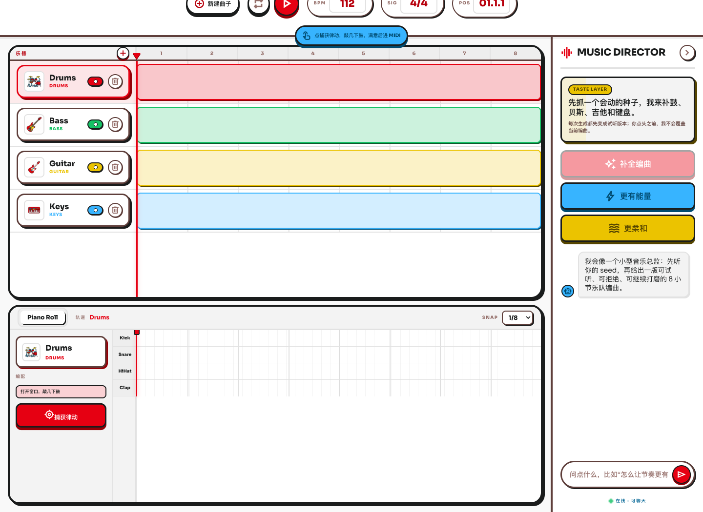
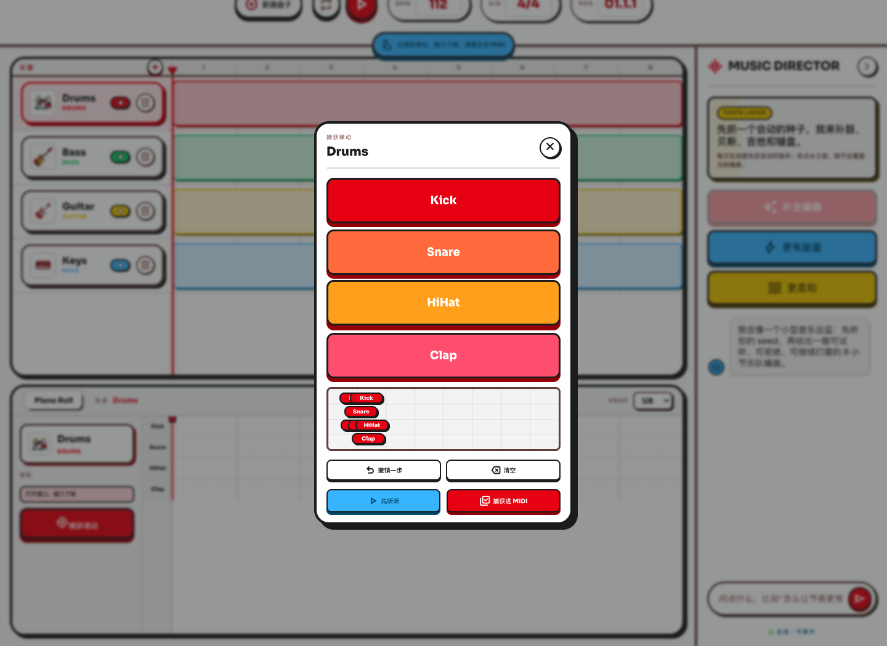
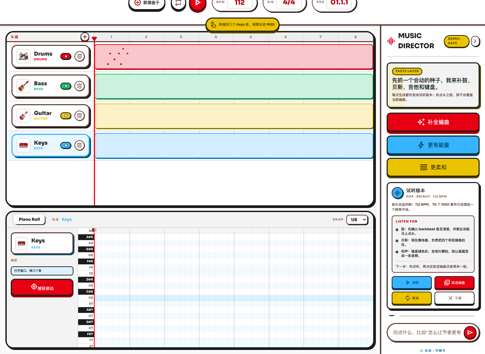
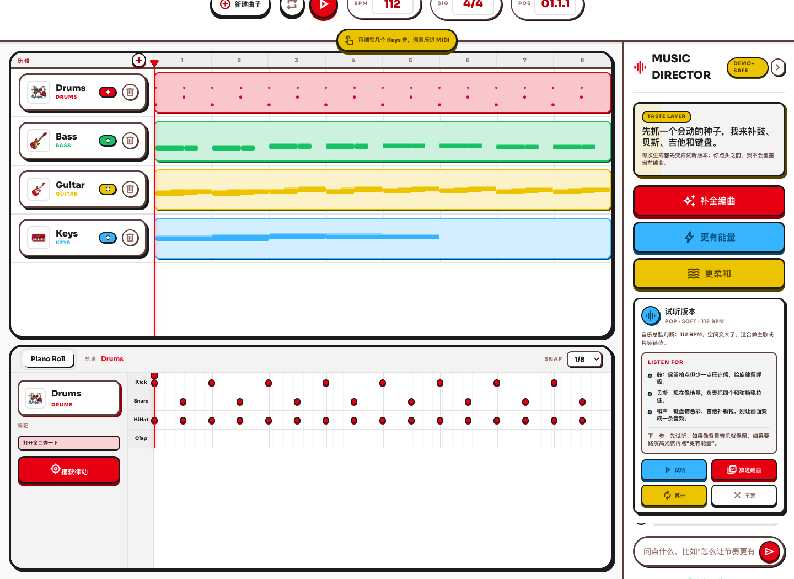

# PlayBand AI

**先玩出一个小灵感，再看 AI 音乐导演把它变成一支乐队。**

PlayBand AI 是一个黑客松原型，面向有音乐品味、但不懂乐理，也不会使用专业 DAW 工具的人。它不是让用户输入一句话，然后等待 AI 生成一段黑箱音频；而是让用户先敲出一个小节奏，看它变成结构化的 MIDI-like 片段，再和一个 demo-safe 的音乐导演进行多轮协作。

- **在线演示：** https://wenwen.zone/playband/
- **代码仓库：** https://github.com/wtn98498/SoloVerseHackathon-ArrangeAgent
- **核心承诺：** 先玩，再编曲。



## 为什么它值得赢

大多数 AI 音乐 demo 会把创作过程藏起来：输入 prompt，等待，然后得到一段音频文件。第一次看确实很惊艳，但它不像是在“做音乐”。

PlayBand AI 把人留在创作循环里：

- 用户从一个身体性的、玩具感的动作开始：敲几下。
- App 把这个动作记录成可编辑的音乐数据，而不只是声音。
- Agent 把这个想法补全成鼓、贝斯、吉他和键盘。
- 每次生成都先成为候选，用户可以试听、拒绝、应用，或者继续对话。

这个记忆点足够简单，评委可以直接复述：

> “我敲了一个节奏，Agent 把它变成了一支乐队。”

## Demo 故事

### 1. 从空白工作室开始

App 打开时像一个音乐玩具，而不是专业 DAW。用户可以从零开始，也可以让系统先给一个 starter groove。



### 2. 捕捉一个人的音乐种子

用户打开 capture pad，敲几个鼓点。App 会立刻把这个 seed 显示成时间数据，让 AI 的生成结果有一个来自用户自己的落点。



### 3. 让音乐导演补全乐队

当 seed 进入时间线后，本地 Music Director 会创建一个候选编曲。它会解释自己改了什么、应该听哪里，以及下一步可以怎样继续创作。



### 4. 继续指挥

用户可以继续用自然语言提出要求，比如“更像路演开场”“再快一点”“更柔和一点”“给主旋律留出空间”。Agent 会让音乐工作流在多轮对话中继续前进。



## 60 秒评委演示路线

1. 打开 https://wenwen.zone/playband/。
2. 选择 **随便玩玩**。
3. 点击 **捕获律动**，依次敲 Kick、HiHat、Snare、Clap。
4. 点击 **捕获进 MIDI**。
5. 点击 **补全编曲**。
6. 试听候选版本。
7. 点击 **放进编曲**。
8. 对 Agent 说：`再快一点，像路演开场一样更抓耳`。
9. 应用这个版本，然后继续说：`再柔和一点，给主旋律留出呼吸`。

这条流程在一分钟内展示完整产品闭环：玩具式输入、结构化音乐数据、Agent 推理、候选优先控制，以及多轮 taste 调整。

## 现在已经可用

- 四轨编曲界面：鼓、贝斯、吉他和键盘。
- 基于 Tone.js 的浏览器音频播放。
- Pad 捕捉流程，可以把敲击转成 MIDI-like 事件。
- Piano-roll 风格可视化，用来建立信任并支持轻量编辑。
- Agent 候选卡片，支持试听、应用、重试和丢弃。
- 多轮音乐请求，例如更快、更柔、更有能量，或者更像开场段落。
- Demo-safe 的确定性音乐生成：即使没有 API key，在线演示仍然可用。
- 对在世艺术家风格请求会转写为更宽泛的音乐特征，而不是直接模仿。

## 音乐导演设计

公开 demo 有意采用 local-first 设计。它不会假装远程模型永远可用，而是使用一个确定性的音乐导演，把音乐意图路由成可靠动作：

- **补全编曲：** 把一个 seed 扩展成 8 小节乐队 loop。
- **增加能量：** 提升强度、velocity 和节奏密度。
- **柔化编曲：** 留出更多空间，降低压迫感。
- **以音乐导演身份回应：** 解释改动，并建议下一步应该听什么、改什么。

这样可以保证 demo 稳定。不同风格和情绪请求会真实改变 MIDI 事件形态：鼓点位置、和声根音、贝斯运动、吉他织体和键盘密度。

## 技术形态

PlayBand AI 使用轻量 MIDI-like JSON 模型，而不是完整 DAW 引擎。核心对象是 `ArrangementProject`，包含：

- `tempo`、`style`、`mood` 和 8 小节长度
- 四个 `Track` 对象
- 包含 `NoteEvent` 或 `DrumHit` 数据的 `Clip` 对象
- 每段编曲 128 个十六分音符 step

这个结构很重要，因为 AI 结果是可见、可播放、可变换的。它不是一团生成出来的音频 blob。

## 技术栈

- React 18
- TypeScript
- Vite
- Tone.js
- 自定义本地编曲引擎
- 为 post-demo 模型集成预留的 DeepSeek-ready 服务边界

## 本地运行

```bash
npm install
npm run dev
```

然后打开本地 Vite 地址，通常是：

```text
http://127.0.0.1:5173/
```

常用检查命令：

```bash
npm run typecheck
npm run build
VITE_BASE_PATH=/playband/ npm run build
```

## 可选 AI Key

提交版在线 demo 不需要模型 key 也能工作。如果想在本地实验 DeepSeek chat/proxy 路径，可以从 `.env.example` 创建本地环境文件，并设置：

```text
DEEPSEEK_API_KEY=your_api_key_here
```

不要提交真实 API key。

## 黑客松范围

这不是一个完整 DAW。MVP 有意避开插件托管、账号系统、云同步、多人协作、大型采样库和复杂导出流程。

目标只有一个让人忘不掉的产品瞬间：

**敲几下，变成一支乐队；而且用户一直掌握控制权。**
